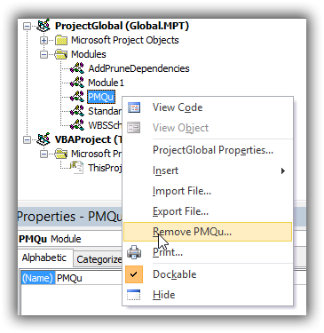

# PMQu
PMQu is an open-source project information quality checker for [MS Project](https://products.office.com/en-us/Project)

# Contents
- [Installing](#installing)
    - [First time Instructions](#first-time-instructions) 
    - [Upgrade Instructions](#upgrade-instructions)
- sdsd
- sdsd
- sdfsdf

# PMQu is sustained by your interest
* Download and use PMQu in your project or PMO.
* Log an issue or a feature request.
* Clone the repository, add a feature or bugfix, and send a pull request.

# Installing
*Installing PMQu requires beginner skills in using Visual Basic for Microsoft Office Applications (VBA).* 
## First Time Instructions
### Install PMQu for the first time
PMQu is a Visual Basic for Applications macro that works with MS Project 2010-2013.  Here are the instructions for a first time installation.
* Download the [PMQu.bas](https://github.com/DavidPratten/PMQu/raw/master/PMQu.bas) file
* Open MS Project
* Click Alt+F11 to open the Microsoft Visual Basic for Applications window.
* ...

### Add PMQu to the ribbon

## Upgrade Instructions
To upgrade to the latest version of PMQu, follow these steps to remove the old version and then proceed as for a First Time Installation
* Open MS Project
* Click Alt+F11
* Remove the PMQu module as shown here   

* Proceed to install PMQu as above for first time installers.
Dagre-d3 is a [D3](http://d3js.org)-based renderer for [dagre](https://github.com/cpettitt/dagre).

#Quality Checks   
##Project  
33: Project Summary Task is visible  
36: Recommend the following settings under File > Options > Schedule  
- New tasks created: [Auto Scheduled]  
- Auto scheduled tasks scheduled on: [Project Start Date]  
- Duration is entered in: [Days]  
- Work is entered in: [Hours]  
- Default task type: [Fixed Units]  
- ☐ New tasks are effort driven  
- ☐ Autolink inserted or moved tasks  
- ☐ Split in-progress tasks  
- ☐ Update Manually Scheduled tasks when editing links  
- ☐ Tasks will always honor their constraint dates  
- ☑ Show that scheduled tasks have estimated durations  
- ☑ New scheduled tasks have estimated durations  
- ☐ Keep task on nearest working day when changing to Automatically Scheduled mode  
- ☐ Show task schedule warnings  
- ☐ Show task schedule suggestions  

37: You are not using MS Project 2010 or 2013: Your mileage may vary.  
47: Recommend the following settings under Project > Project Information  
- Schedule From [Project Start Date]  

##Task Identity  
19: Tasks with Duplicate Names  
40: Task has blank name  
44: Task with duplicate 'Permanent ID' field  
49: Permanent ID field must be 1 or greater  

## Work Breakdown Structure (WBS) / Product Breakdown Structure (PBS)  
13: Summary without Start or Finish milestones  
23: Start Milestone is not the predecessor of its siblings  
24: Finish Milestone is not the successor of its siblings  
27: Summary has fewer than two children  
32: Project has more than one top level task (You may add a 'Status Date Milestone' at Outline Level 1 with Start No Earlier Than constraint)  
41: Only this Summary Task's Start Milestone's name may begin with 'Start '  
42: Only this Summary Task's Finish Milestone's name may begin with 'Finish '  

## Network  
2: Summary with Successors  
3: Summary with Predecessors  
10: Tasks/Milestones without predecessor  
11: Tasks/Milestones without successor  
31: Dependency is redundant  
38: 'Status Date Milestone' has a predecessor.  
39: 'Status Date Milestone' has a successor that is not floating, it has already started.  
43: Dependency may not be with self, not with parent Tasks, nor with child Tasks  
46: Tasks with common predecessors suggests that an Interim Milestone is missing  
48: Use an Interim Milestone as the predecessor or successor.  
51: Start Milestone has a successor which is not a sibling  
52: Finish Milestone has a predecessor which is not a sibling  

## Resources  
1: Summary with Resource Assignments  
9: Task Type other than Fixed Units  
14: Milestone with Resource Assignments  
50: Task is Effort Driven.  

## Scheduling  
4: Task with elapsed time > 30 days  
5: Milestone with constraint type other than ASAP, MSO, SNET, or FNLT  
6: Task with constraint type other than ASAP. Use Deadlines or put constraint on a milestone  
7: Summary with constraint type other than ASAP  
8: Manually scheduled  
12: Tasks without duration specified  
20: Tasks with sub-day duration  
28: Unmet constraint generating negative slack  
29: Task has more than 30 days slack  
35: A successor of Status Date Milestone has less than 10 days slack  

## Progress  
21: Tasks with Start date before Status Date with no Actual Start date  
22: Tasks with Finish date before Status Date with no Actual Finish date  
25: Actual Start is after Status Date  
26: Actual Finish is after Status Date  
30: Milestone %Complete must be 0% or 100%  

# FAQ
##How to turn off a quality check
Checks may be excluded for individual tasks by listing the unwanted check numbers, comma separated, in a "Health Check Exclusions" custom Text Column. Checks may be turned off for the whole project by listing the check numbers in this column in the Project Summary Task.  
# License

PMQu is licensed under the terms of the MIT License. See [LICENSE](/cpettitt/dagre/blob/master/LICENSE) for details.
